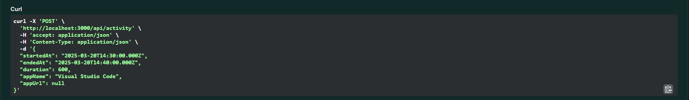
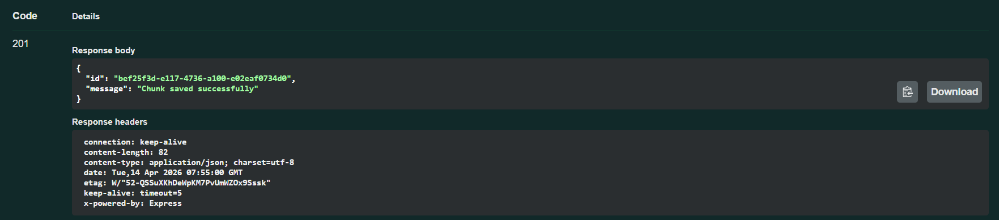
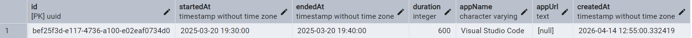
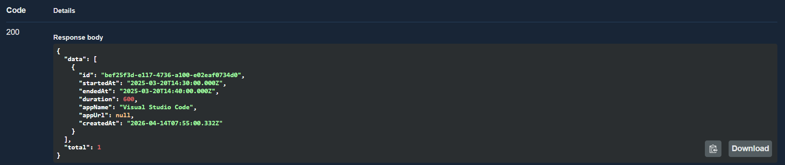

# Desktop Tracker Backend

Backend-сервис на NestJS для сбора и хранения чанков активности пользователя.

## 1. Стек

- NestJS 11
- TypeScript
- PostgreSQL
- TypeORM
- Docker / Docker Compose
- Swagger (OpenAPI)

## 2. Что реализовано

- Прием чанка активности: `POST /api/activity`
- Получение списка чанков: `GET /api/activity`
- Валидация входящих данных через `class-validator`
- Проверка `duration` на расхождение с `(endedAt - startedAt)` более чем 5 секунд
- Уникальное ограничение по комбинации `(startedAt, appName, appUrl)`
- Глобальный `ExceptionFilter`
- Swagger UI и OpenAPI JSON
- Запуск в Docker Compose (`app + postgres`)

## 3. Быстрый старт

### 3.1 Локально (без Docker)

1. Установить зависимости:

```bash
pnpm install
```

2. Создать `.env` на основе `.env.example`:

```bash
cp .env.example .env
```

3. Заполнить переменные окружения:

- `PORT`
- `DB_HOST`
- `DB_PORT`
- `DB_USERNAME`
- `DB_PASSWORD`
- `DB_NAME`

4. Запустить приложение:

```bash
pnpm run start:dev
```

Приложение будет доступно на `http://localhost:3000`.

### 3.2 Через Docker Compose

```bash
docker compose up --build
```

ИЛИ

```bash
docker-compose up -d
```

Сервисы:

- `app` на порту `3000`
- `postgres` на порту `5432`

## 4. Конфигурация

Используются следующие переменные окружения:

```env
PORT=3000
DB_HOST=localhost
DB_PORT=5432
DB_USERNAME=postgres
DB_PASSWORD=your_password
DB_NAME=desk_tracker
```

## 5. API

Базовый префикс API: `/api`

### 5.1 POST /api/activity

Создает чанк активности.

Пример тела запроса:

```json
{
	"startedAt": "2025-03-20T14:30:00.000Z",
	"endedAt": "2025-03-20T14:40:00.000Z",
	"duration": 600,
	"appName": "Visual Studio Code",
	"appUrl": null
}
```



Успешный ответ (201):

```json
{
	"id": "550e8400-e29b-41d4-a716-446655440000",
	"message": "Chunk saved successfully"
}
```



А также новая строка в базе данных:



### 5.2 GET /api/activity

Возвращает все сохраненные чанки.

Пример ответа (200):

```json
{
	"data": [
		{
			"id": "550e8400-e29b-41d4-a716-446655440000",
			"startedAt": "2025-03-20T14:30:00.000Z",
			"endedAt": "2025-03-20T14:40:00.000Z",
			"duration": 600,
			"appName": "Visual Studio Code",
			"appUrl": null,
			"createdAt": "2025-03-20T14:41:00.000Z"
		}
	],
	"total": 1
}
```



## 6. Swagger

- Swagger UI: `http://localhost:3000/api/docs`
- OpenAPI JSON: `http://localhost:3000/api/docs-json`

## 7. Полезные команды

```bash
pnpm run build
pnpm run start:dev
pnpm run lint
pnpm run test
pnpm run test:e2e
pnpm run migration:run
pnpm run migration:revert
pnpm run migration:show
```

## 8. Примеры curl

Создать чанк:

```bash
curl -X POST http://localhost:3000/api/activity \
	-H "Content-Type: application/json" \
	-d '{
		"startedAt":"2025-03-20T14:30:00.000Z",
		"endedAt":"2025-03-20T14:40:00.000Z",
		"duration":600,
		"appName":"Visual Studio Code",
		"appUrl":null
	}'
```

Получить чанки:

```bash
curl http://localhost:3000/api/activity
```